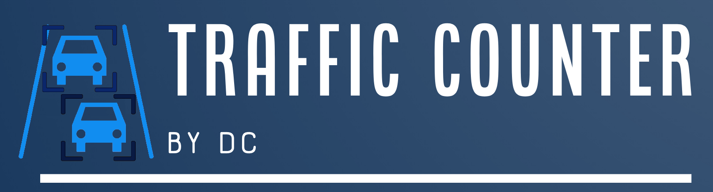

Application uses deep neural networks and tracking algorithms to determine the trajectories of road traffic participants and count their flow in the specified video recording. The application utilizes three neural networks for object detection: [RT-DETR](https://arxiv.org/pdf/2304.08069), [YOLOv6 3.0](https://arxiv.org/pdf/2301.05586), and [CO-DETR](https://arxiv.org/pdf/2211.12860), as well as four tracking algorithms: [DeepOCSORT](https://arxiv.org/pdf/2302.11813.pdf), [SmileTrack](https://arxiv.org/pdf/2211.08824), [BoT-SORT](https://arxiv.org/pdf/2206.14651.pdf) and BoT-SORT+ (own modification).

Traffic Counter by DC is based on one of the modules of the [OpenTrafficCam](https://opentrafficcam.org/) project - [OTAnalytics](https://github.com/OpenTrafficCam/OTAnalytics).

This application was written for the purposes of master's thesis: *Vehicle traffic analysis at intersections using deep neural networks and tracking algorithms*

# Requirements

### Python version

3.10

### Libs

```sh
pip install -r requirements.txt
pip uninstall torch torchvision torchaudio
pip install torch==1.11.0+cu113 torchvision==0.12.0+cu113 torchaudio==0.11.0 --extra-index-url https://download.pytorch.org/whl/cu113
pip install mmcv-full==1.7.0 -f https://download.openmmlab.com/mmcv/dist/cu113/torch1.11.0/index.html
```

### Others

To enable video processing, you need to download the weights for the detection and tracking algorithms and place them into  ```weights``` directory:

- [CO-DETR](https://drive.google.com/file/d/1KOqpiXyLRxi2i4zY0BSSIBO_wIWLwQIw/view?usp=drive_link)
- [RT-DETR](https://drive.google.com/file/d/17A2oPf2CuV-pcjyiESibN_HMzT3e10YW/view?usp=drive_link)
- [YOLOv6 3.0](https://drive.google.com/file/d/1bMGABSSnQWD0aMSPiHIDjWPKpK1c1I2-/view?usp=drive_link)

# Run

```sh
python -m traffic_counter
```
